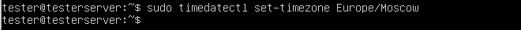

# **Report "Linux"**
 <font color="green">

**Установка и обновление системы Linux.**  
***Основы администрирования.***  
</font>

# Содержание
1. [Part 1. Установка ОС](#part-1-установка-ос)
2. [Part 2. Создание пользователя](#part-2-создание-пользователя)
3. [Part 3. Настройка сети ОС](#part-3-настройка-сети-ос)
4. [Part 4. Обновление ОС](#part-4-обновление-os)  
5. [Part 5. Использование SUDO](#part-5-использование-sudo)  
6. [Part 6. Установка службы времени](#part-6-установка-службы-времени)  
7. [Part 7. Текстовые редакторы](#part-7-текстовые-редакторы)
8. [Part 8. Настройка SSHd](#part-8-настройка-sshd)
9. [Part 9. Установка top, htop](#part-9-установка-top-htop)
10. [Part 10. Использование fdisk](#part-10-использование-fdisk)  
11. [Part 11. Использование df](#part-11-использование-df)
12. [Part 12. Использование du](#part-12-использование-du)
13. [Part 13. Использование ncdu](#part-13-использование-ncdu)
14. [Part 14. Системные журналы](#part-14-системные-журналы)
15. [Part 15. Использование CRON](#Cron)

## Part 1. Установка ОС

*Install OS Ubuntu 20.04*

Узнать версию Ubuntu с помощью команды  ```cat /etc/issue```

  

## Part 2. Создание пользователя

Создание пользователя, который добавлен в группу ```adm```:


Вывод команды ```cat /etc/passwd```:


## Part 3. Настройка сети ОС

Установила название машины вида ```user-1```:


Установила временную зону, соответствующую текущему местоположению:



Вывела названия сетевых интерфейсов с помощью консольной команды:


* **lo** или **local loopback** (*локальная петля*) – это виртуальное сетевое устройство, полностью реализованное в программном обеспечении, используется для того, что-бы компьютер мог обращаться к самому себе и имеет по-умолчанию ip-адрес **127.0.0.1**, весь отправляемый на него трафик "зацикливается" и нацелен только на службы на вашем локальном компьютере.

Получила ip адрес устройства от DHCP сервера:


* **Dynamic Host Configuration Protocol (DHCP)** — это протокол, используемый для автоматической конфигурации сетевых устройств, таких как компьютеры, маршрутизаторы, принтеры и другие сетевые узлы. **DHCP** позволяет устройствам в сети автоматически получать IP-адреса и другие сетевые настройки, такие как маска подсети, адрес шлюза и DNS-сервера.

Определила внешний ip-адрес шлюза:


Определила внутренний ip-адрес шлюза:


Задала статичные настройки ip, gw, dns, изменив файл ```/etc/netplan/*.yaml``` и применив команду sudo netplan apply для сохранения изменений:


Перезагрузила виртуальную машину командой ```shutdown -r now``` и проверила изменения:


Отчет после того, как пропинговала удаленные хосты ```1.1.1.1``` и ```ya.ru```:


## Part 4. Обновление OS

Повторная попытка обновить систему:


## Part 5. Использование sudo

**sudo** — команда, которая наделяет правами суперпользователя, ее используют прежде какой-либо иной команды в консоли для выполнения с правами администратора.

Вывод использования созданным пользователем команды ```sudo```:


## Part 6. Установка службы времени

Вывод корректного времени и команды ```timedatectl show```:


## Part 7. Текстовые редакторы

* **VIM**: для выхода с сохранением для начала ```Esc``` для выхода из режима редактирования, а потом ```:wq```:


* **NANO**: для выхода с сохранением для начала ```Ctrl+o```, а потом ```Ctrl+x```:


* **EMACS**: для выхода с сохранением для начала ```Ctrl+x```, а потом ```Ctrl+s```:


* **VIM**: для выхода без сохранения для начала ```Esc``` для выхода из режима редактирования, а потом ```:q!```:


* **NANO**: для выхода без сохранения для начала ```Ctrl+x```, а потом ```N```, что означает No, то есть не согласны на сохранение:


* **EMACS**: для выхода без сохранения для начала ```Ctrl+x```, а потом ```Ctrl+c```, а после выбираем ```n```:


* **VIM**: для поиска ```/что_ищем```:


* **VIM**: для замены ```:s/что_заменяем/на_что_заменяем```:


* **NANO**: для поиска ```Ctrl+w```:


* **NANO**: для замены ```Alt+r```, потом вводим, что заменяем, потом, на что заменяем:


* **EMACS**: для поиска ```Ctrl+s```:


* **EMACS**: для замены ```Alt+Shift+%```, потом указывается, что заменяется, потом, на что заменяется:


## Part 8. Настройка SSHd

* Установила службу SSHd с помощью команды ```sudo apt-get install ssh```
* Добавила автостарт службы при загрузке командой ```sudo systemctl enable ssh```
* Для перенастройки службы SSHd на порт 2022 для начала открыла файл ```/etc/ssh/sshd_config``` для редактирования ```nano /etc/ssh/sshd_config```, заменяем Port 22 на Port 2022, сохранила изменения файла и сделала перезагрузку ```systemctl restart ssh```
* Отобразила наличие процесса sshd с помощью команды ```ps -e | grep sshd```, где
    * ```ps``` - команда, которая выводит список текущих процессов на сервере,
    * ```e``` - опция, которая помогает выбрать все процессы,
    * ```grep```, который фильтрует результаты из команды ```ps```, чтобы вывести строки содержащие ключевое слово sshd:


* Перезагрузила систему с помощью команды ```shutdown -r now```
* Вывод команды netstat ```-tan```:


* ```tan```
    * t - выводит только TCP-соединения
    * a - позволяет просмотреть сведения о состоянии всех сокетов
    * n - показывает сетевые адреса как числа, так как netstat обычно показывает адреса как символы
* Столбцы выведенной команды:
    * Proto - протокол (tcp, udp, raw), используемый сокетом
    * Recv-Q - счётчик байт не скопированных программой пользователя из этого сокета
    * Send-Q - счётчик байтов, не подтверждённых удалённым узлом
    * Local address - адрес и номер порта локального конца сокета
    * Foreign Address - адрес и номер порта удалённого конца сокета
    * State - текущее состояние сокета, такое как ESTABLISHED (установленное), LISTENING (ожидающее соединения), TIME_WAIT и другие
* ```0.0.0.0``` - это немаршрутизируемый адрес IPv4, который можно использовать в разных целях, в основном, в качестве адреса по умолчанию или адреса-заполнителя

## Part 9. Установка top, htop

* Отчет по выводу команды ```top```:
    * uptime: 1:02
    * количество авторизованных пользователей: 1 user
    * общая загрузка системы: 0,00, 0,00, 0,00 (за последние 1, 5, 15 минут)
    * общее количество процессов: 97 total
    * загрузка cpu: 0,0 us, 0,0 sy, 0,0 ni, 100,0 id, 0,0 wa, 0,0 hi, 0,0 si, 0,0 st
    * pid процесса, занимающего больше всего памяти: 932
    * pid процесса, занимающего больше всего процессорного времени: 4292

Вывод команды ```htop```, отсортированный по PID:


Вывод команды ```htop```, отсортированный по PERCENT_CPU:


Вывод команды ```htop```, отсортированный по PERCENT_MEM:


Вывод команды ```htop```, отсортированный по TIME:


Вывод команды ```htop```, отфильтрованный для процесса sshd:


Вывод команды ```htop``` с процессом syslog:


Вывод команды ```htop``` с добавленным выводом ```hostname```, ```clock```, ```uptime```:


## Part 10. Использование fdisk

* Отчет по выводы команды: 
    * название жесткого диска: /dev/sda
    * размер жесткого диска: 40 Gib (42949672960 bytes)
    * количество секторов: 83886080 sectors
    * размер swap: 2097148 Kib


## Part 11. использование df

* Отчет команды ```df``` для корневого раздела (/): 
    * размер раздела: 19430032
    * размер занятого пространства: 5347132
    * размер свободного пространства: 13070576
    * процент использования: 30%


* Единица измерения - байты (bytes).
* Отчет команды ```df -Th``` для корневого раздела (/):
    * размер раздела: 19G
    * размер занятого пространства: 5,1G
    * размер свободного пространства: 13G
    * процент использования: 30%


* Тип файловой системы - ext4.

## Part 12. Использование du

* Вывод команды ```du```:


Вывод размера папки ```/home``` с помощью команды ```du``` (для вывода в человекочитаемом виде):


Вывод размера папки ```/var``` команды ```du``` (для вывода в человекочитаемом виде):


Вывод размера папки ```/var/log``` с помощью команды ```du``` (для вывода в человекочитаемом виде):


Вывод размера папки ```/var/log/*``` с помощью команды ```du``` (для вывода в человекочитаемом виде):


## Part 13. Использование ncdu

Вывод размера папки ```/home``` с помощью команды ```ncdu```:


Вывод размера папки ```/var``` команды ```ncdu```:


Вывод размера папки ```/var/log``` с помощью команды ```ncdu```:


## Part 14. Системные журналы

* Отчет последней авторизации: 
    * время: 00:57:01
    * имя пользователя: tester
    * метод входа: через sudo


## Part 15. Использование планировщика заданий CRON

Выполнение задач:


Список текущих задач:


Список текущих задач после удаления всех заданий:

